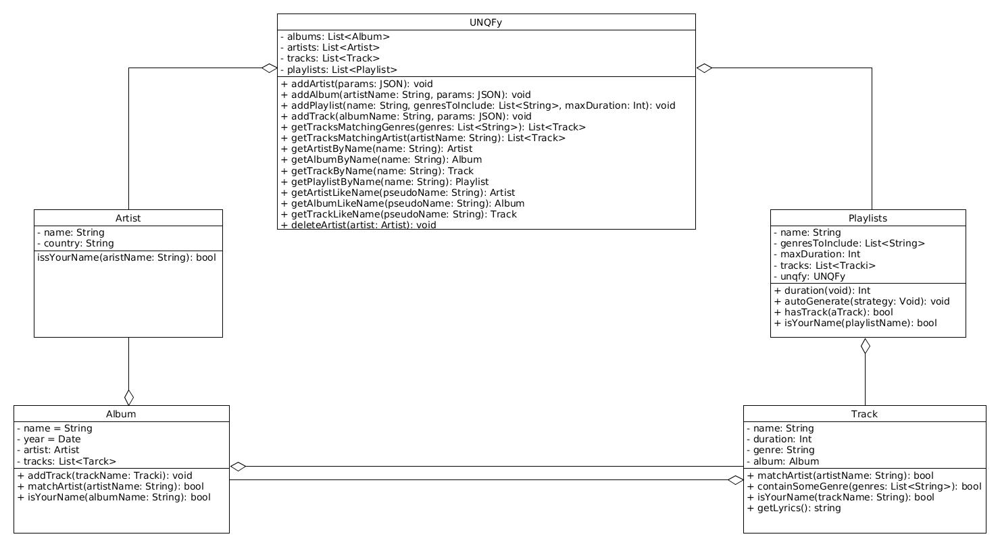

# UNQfy #

## CLI:


### Parameters available: ###

Parameter                | Defition
------------------------ | -------------------------------------------
--addArtist              | Create and add new artist                  
--addAlbum               | Create and add new album                   
--addTrack               | Create and add a new track                 
--showAlbumWithName      | Show artists that include ARG1 in your name
--showTrackWithName      | Show albums that include ARG1 in your name 
--showArtistWithName     | Show tracks that include ARG1 in your name 
--showTrackWithArtist    | Show track interpreted by ARG1             
--showTrackWithGenre     | Show track of the gender ARG1              
--createPlaylist         | Create a new playlist                      
--showPlayList           | Show playlist data                         


### Commands usage: ###

* node main.js --addArtist "Name LastName" Contuntry
* node main.js --addAlbum "Artist" "AlbumName" Year
* node main.js --addTrack  "TrackName" "AlbumName" "MM:SS" genre
* node main.js --showAlbumWithName string
* node main.js --showTrackWithName string
* node main.js --showArtistWithName string
* node main.js --showTrackWithArtist "ArtistName ArtistLastName"
* node main.js --showTrackWithGenre enre
* node main.js --createPlaylist "PlaylistName" "MM:SS" genre
* node main.js --showPlayList "PlaylistName"

### Demo: ###
For your happiness the script launcher.sh executa all commands available. 
 * Run:
``` 
    cd src
    sh launcher.sh
``` 

## Class Diagram ##

